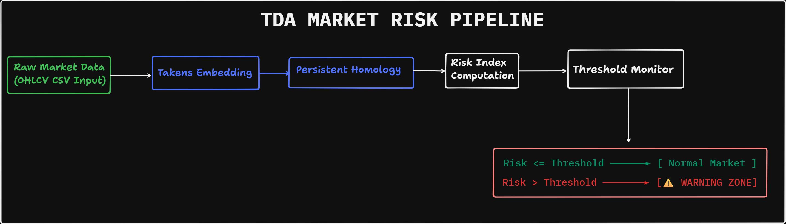
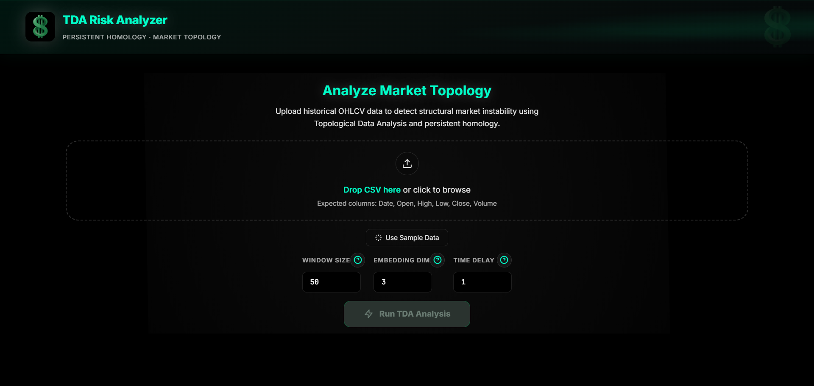
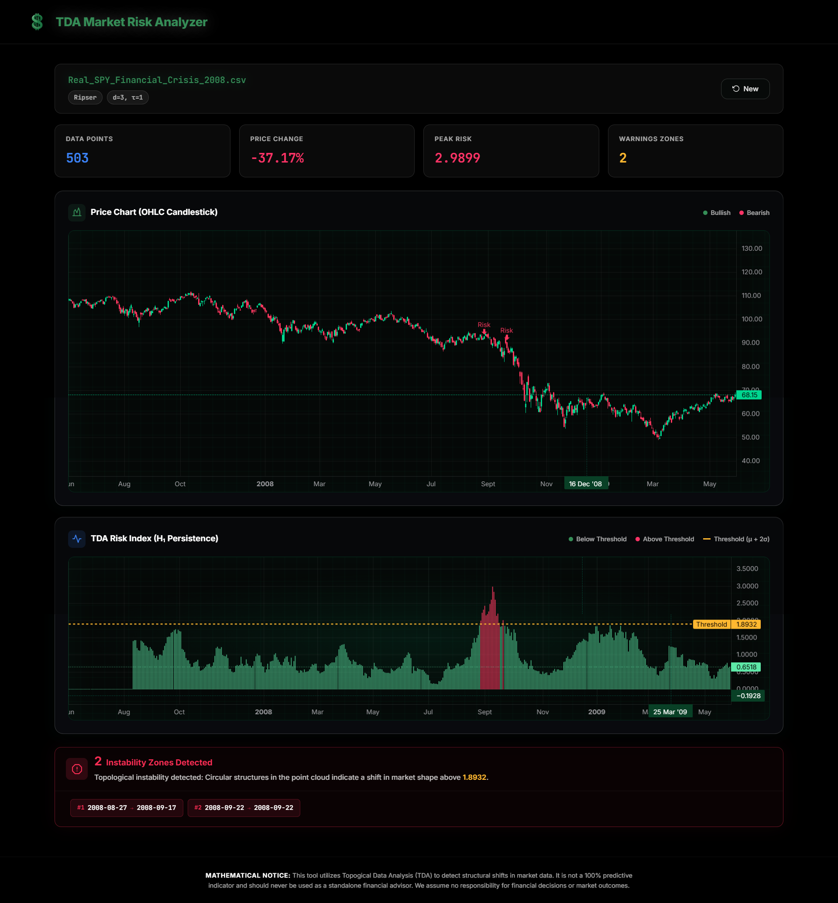

# 💲 TDA Market Risk Analyzer

**Topological Data Analysis for Financial Crash Prediction**

A premium, real-time financial risk detection system that moves beyond traditional statistical indicators by applying the advanced mathematics of **Topological Data Analysis (TDA)**. Specifically utilizing **Persistent Homology**, this engine treats market data as a **multi-dimensional** geometric shape. By continuously monitoring the **"shape"** of the market, it detects hidden structural tearing and topological anomalies—providing an institutional-grade early warning system that identifies critical market instability days before catastrophic crashes occur.

---

## Overview

Traditional risk indicators (RSI, Bollinger Bands, VaR) rely on **statistical assumptions** about price distributions. This tool takes a fundamentally different approach:

> It treats the price time series as a **geometric shape** in high-dimensional space and analyzes its **topological features** — specifically, the formation and collapse of "holes" (loops) in the data's structure — to detect when the market's geometry is breaking down.

**When the topology collapses, a crash is likely imminent.**

---

## How It Works — The TDA Pipeline


### 1️⃣ Stage 1: Takens Time-Delay Embedding

Converts a flat 1D price series into a multi-dimensional **point cloud** using [Takens' Embedding Theorem](https://en.wikipedia.org/wiki/Takens%27s_theorem):

Given: $x_1, x_2, \dots, x_n$ (closing prices)  
Embed:
$$v_i = (x_i, x_{i+\tau}, x_{i+2\tau}, \dots, x_{i+(d-1)\tau})$$

- **Dimension ($d$)**: Number of coordinates per embedded vector (default: 3)
- **Time Delay ($\tau$)**: Spacing between observations (default: 1)

### 2️⃣ Stage 2: Vietoris-Rips Persistent Homology

Constructs a [Vietoris-Rips filtration](https://en.wikipedia.org/wiki/Vietoris%E2%80%93Rips_complex) on the point cloud and tracks the birth and death of topological features:

- **$H_0$ (Connected Components)**: Clusters in the data
- **$H_1$ (Loops / 1-Cycles)**: Circular structures that form and collapse

### 3️⃣ Stage 3: Risk Index Computation

The **Risk Index** is computed as the **$L_1$-norm** (total persistence) of all $H_1$ features:

$$\text{Risk Index} = \sum_{i} |\text{death}_i - \text{birth}_i|$$

A spike in this index indicates that the topological structure of the market is undergoing rapid change — a precursor to a crash.

---

## Architecture

```
TDA/
├── main.py              # FastAPI backend server
├── tda_pipeline.py       # Core TDA computation engine
├── requirements.txt      # Python dependencies
├── README.md             # This file
└── static/
    ├── index.html        # Single-page frontend application
    ├── css/
    │   └── style.css     # Design system (True Black + Neon theme)
    ├── js/
    │   └── app.js        # Frontend application logic
    └── images/

```

---

## Quick Start

### Prerequisites

- **Python 3.10+**
- **pip** (Python package manager)

> [!NOTE]
> **TDA Engine Compatibility:** While the core application supports Python up to 3.13, the premium **Giotto-TDA** engine currently requires a stable Python environment (3.10 or 3.11). If you are using a newer version like Python 3.13, the pipeline will automatically and gracefully fall back to the **Ripser** engine to ensure uninterrupted analysis.

### Installation

```bash
# 1. Clone the repository
git clone https://github.com/MohamedAli1937/TDA-Market-Risk-Analyzer.git
cd TDA-Market-Risk-Analyzer

# 2. Install dependencies (includes Ripser engine by default)
pip install -r requirements.txt

```

### Running

```bash
# Start the server
uvicorn main:app --reload --port 8000
```

Then open [http://localhost:8000](http://localhost:8000) in your browser.

---



---

## TDA Engines

The application supports **three TDA computation backends**, automatically selecting the best available:

| Priority | Engine             | Package            | Description                                                                                                           |
| -------- | ------------------ | ------------------ | --------------------------------------------------------------------------------------------------------------------- |
| 1st      | **Giotto-TDA**     | `giotto-tda`       | Full-featured, production-grade. Uses optimized C++ bindings for Vietoris-Rips persistence. Recommended for accuracy. |
| 2nd      | **Ripser**         | `ripser`           | Lightweight and fast. Implements the Ripser algorithm for efficient persistent homology computation.                  |
| 3rd      | **Scipy Fallback** | `scipy` (built-in) | Heuristic approximation using distance matrices. No additional installation needed. Suitable for demos.               |

> The active engine is displayed in the dashboard's **TDA Engine badge** after each analysis run.

---

## Input Format

Upload a CSV file with the following columns:

| Column   | Type      | Description                                       |
| -------- | --------- | ------------------------------------------------- |
| `Date`   | string    | Date in any parseable format (e.g., `2024-01-15`) |
| `Open`   | float     | Opening price                                     |
| `High`   | float     | Highest price                                     |
| `Low`    | float     | Lowest price                                      |
| `Close`  | float     | Closing price                                     |
| `Volume` | int/float | Trading volume                                    |

> **Tip:** You can also use the **"Use Sample Data"** button to generate a synthetic dataset with a simulated crash event for testing.

---

## Parameters

| Parameter               | Default | Range  | Description                                                                                |
| ----------------------- | ------- | ------ | ------------------------------------------------------------------------------------------ |
| **Window Size**         | 50      | 20–500 | Number of data points per rolling analysis window. Controls the "memory" of the indicator. |
| **Embedding Dimension** | 3       | 2–10   | Takens embedding dimension. 3 is the standard for financial time series.                   |
| **Time Delay**          | 1       | 1–10   | Spacing between embedded observations. Keep at 1 for daily data.                           |

> **Configuration Guide Available:** Unsure which values to choose? The application dashboard includes built-in **help notes and tooltips** for each parameter. These guides will help you select the optimal configuration based on your specific market data.

---

## Features

- **📈 Interactive OHLC Candlestick Chart** — TradingView Lightweight Charts with synchronized crosshair
- **📉 TDA Risk Index Chart** — Real-time H₁ persistence visualization with dynamic threshold
- **🔴 Warning Zone Detection** — Automatic identification of instability periods (μ + 2σ threshold)
- **⚡ Live TDA Engine Display** — Shows which computation backend is active
- **📊 Pipeline Info Bar** — Visual breakdown of the mathematical pipeline stages
- **🎨 Premium Dark UI** — True black design with neon accents and glassmorphism
- **📱 Responsive Layout** — Full mobile and tablet support
- **🔧 Parameter Help System** — In-app documentation with trade-off guidance

---

## Mathematical Background

### Persistent Homology

Persistent homology tracks topological features across a range of spatial scales:

- **Birth**: The scale at which a feature first appears
- **Death**: The scale at which a feature disappears
- **Persistence**: `death - birth` — long-lived features are "real" topological structure

### Why Loops Matter (H₁)

In a stable market, price embeddings form smooth, consistent curves. When instability grows:

1. The point cloud begins to form **loops** (H₁ features)
2. These loops have **high persistence** (they don't collapse quickly)
3. The **total persistence** (L₁ norm) spikes
4. This spike **precedes** the actual price crash by several days

This gives TDA its predictive power — it detects **structural change** before it manifests as price change.

---

## 🤝 Contributing

Contributions are welcome! Key areas for improvement:

- Additional TDA backends (e.g., GUDHI, Dionysus)
- Multi-asset comparison views
- Persistence diagram visualization
- Real-time data feeds (WebSocket integration)
- Backtesting framework with historical crash data

---

## 📄 License

This project is licensed under the MIT License.

---
